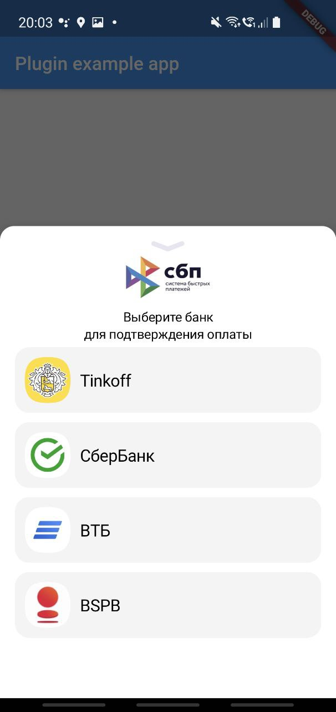

# SbpPaymentsAndroid

[](https://jitpack.io/#MrOlolo/SbpPaymentsAndroid)

### Preview


### Description

Widget handle SBP payment links and show bank apps which support SBP payments

## Installation

You can install this widget with gradle.

To install it, simply add the repo to your project `build.gradle`:
```groovy
allprojects {
    ...
    repositories {
        ...
        maven { url "https://jitpack.io" }
    }
}
```
And add dependency to `app/build.gradle`:
```groovy
...
dependencies {
    ...
    implementation 'com.github.MrOlolo:SbpPaymentsAndroid:v1.01'
}
```

## Usage
Just call `SbpUtils.getInstance().showSbpListDialog()` with payment link

```kotlin
import payments.sbp.SbpUtils

...

fun openWidget() {
    SbpUtils.getInstance().showSbpListDialog(activity, paymentLink)
}
```
